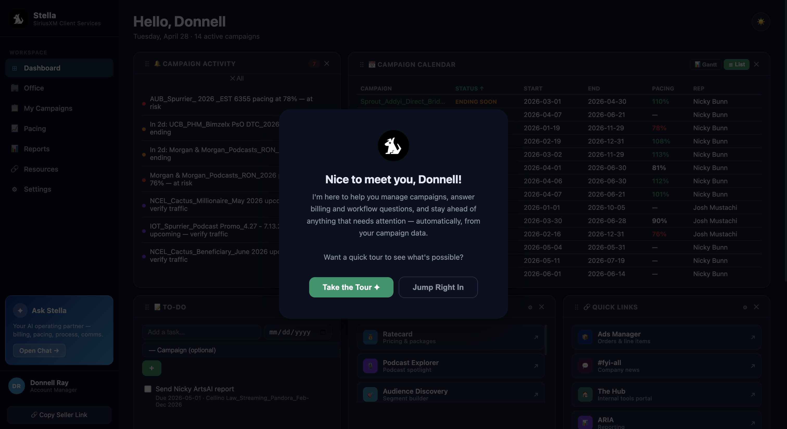
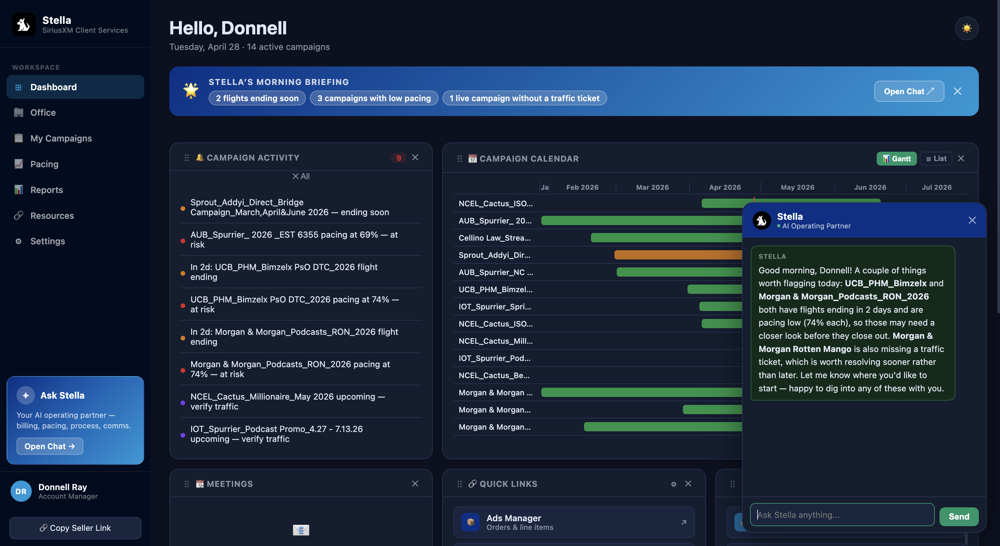
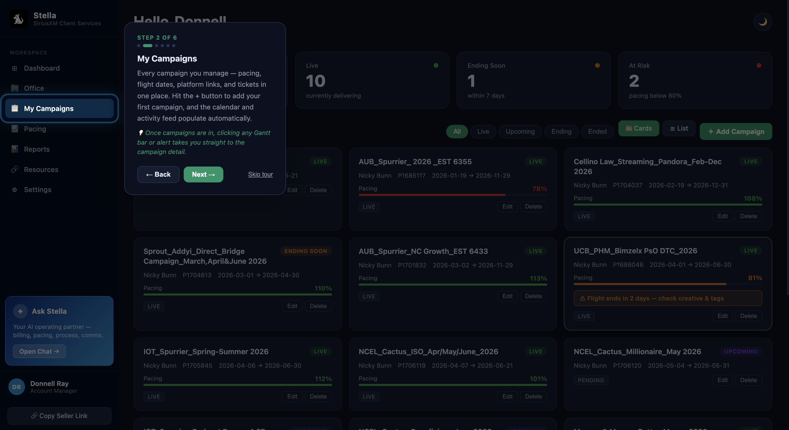
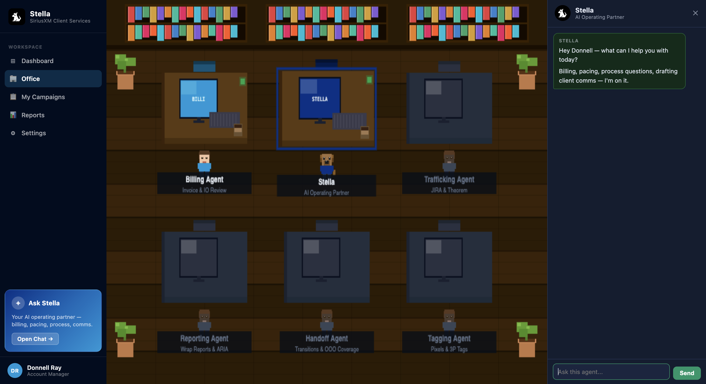
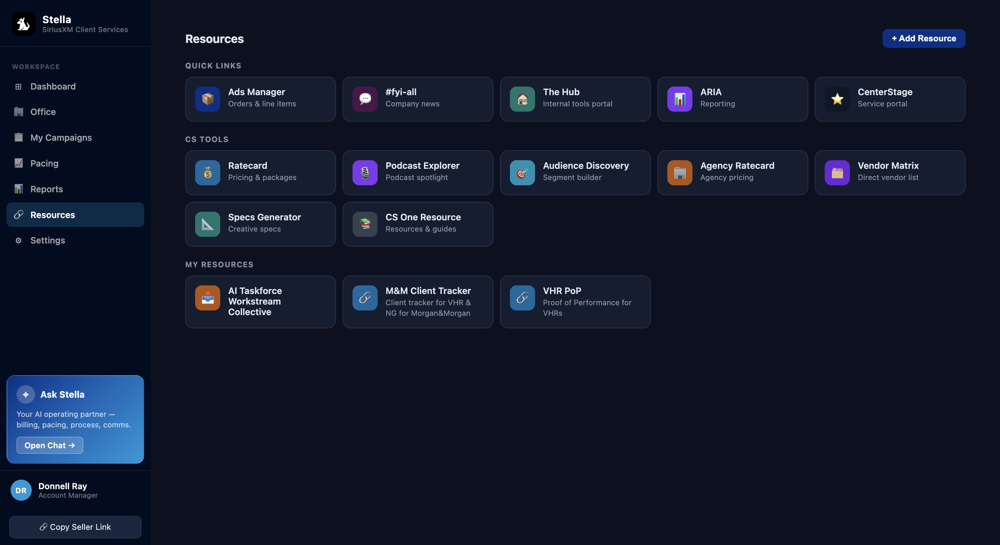
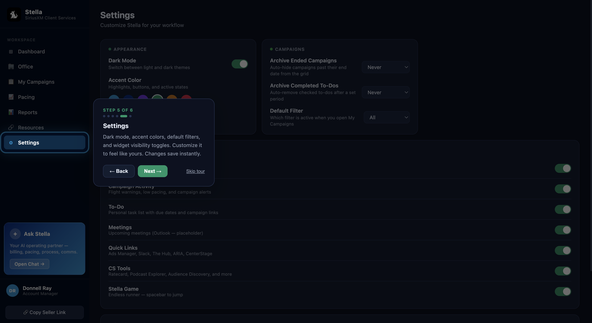

# Stella AI — Client Services Operating Partner

*A case study in turning a fragmented, ad-hoc workflow into a shared, AI-assisted one — without stripping away the flexibility people actually need.*

---

## The Problem

Account Managers at a national media & entertainment company were running their day across a handful of disconnected enterprise apps — one for order status, another for billing, another for reporting, a fifth for tickets — with no single place any of it lived. There was no centralized workflow tool at all.

So each AM built their own. Some kept a personal spreadsheet. Some tracked pacing in a notebook. Some just held it all in their head and reconstructed it from memory when a client called. It worked, individually — until someone went on leave, or handed off a book of business, or left the team, and whoever inherited their campaigns inherited a system only the previous person understood.

That's the actual gap Stella was built to close: not "AMs need an AI assistant," but "this team has no shared source of truth for what a campaign looks like, and every personal workaround makes transitions harder." The AI assistant came second — it's the thing that made a *standardized* system feel as fast and low-friction as everyone's personal spreadsheet already was, so people would actually adopt it instead of quietly going back to their own methods.

## What "Done" Had to Look Like

That framing set the real constraints:

- **No IT install, no new login.** If it required provisioning, it wouldn't get adopted team-wide. It had to run inside the Google Workspace account people already used every day — hence Apps Script instead of a standalone hosted app.
- **Standardized, but not rigid.** Every AM needed to see campaigns the same way — same fields, same statuses — so a handoff didn't mean relearning someone else's system. But it couldn't feel like a rigid enterprise form, or people would quietly route around it the way they'd routed around having no tool at all.
- **Answers, not another tab to check.** The billing and workflow questions that used to mean pinging a teammate or hunting through a wiki needed to live inside the same place the campaign data lived.

## Walking Through the Experience

**Onboarding** starts with name capture, role selection, and a short guided tour rather than a wall of documentation — because the whole point was lowering the activation energy compared to "here's a shared spreadsheet template, please follow the conventions."


*Onboarding — name capture, role selection, and guided spotlight tour*

**The Dashboard** is the first thing an AM sees, and it's deliberately not a form to fill out — it's a morning briefing: a rolling ±90-day Gantt of their campaign calendar, an activity feed, auto-generated alerts for things that need attention (flight warnings, low pacing, ending-soon campaigns), and Stella's chat available immediately. The six widgets are drag-and-drop and independently toggleable, which matters more than it sounds like — it's the same "standardized but not rigid" tension from the problem statement, just applied to the home screen instead of the data model. Everyone gets the same building blocks; nobody gets forced into the same layout.


*Dashboard — morning briefing, campaign calendar Gantt, activity feed, and Stella AI chat*

**My Campaigns** is where the standardization decision actually lands. Every campaign is tracked against the same 23 fields — client name, order IDs, sales rep, flight dates, status, pacing, tickets, billing flags, and platform links — regardless of how any individual AM used to track it before. That's the piece that solves the original OOO/handoff problem directly: whoever picks up a book of business now inherits a structure they already recognize, not someone else's personal spreadsheet logic. The card grid and sortable list view, plus per-section inline editing, are there so that structure doesn't feel like a downgrade from the flexibility of a personal system — you can still update just a pacing number without opening a full form.


*My Campaigns — card grid with color-coded status, pacing bars, and flight warnings*

**Stella**, the AI assistant, is what makes the standardized system faster than the old ad-hoc one instead of slower. She's available as a persistent popup anywhere in the app, and as an inline chat on every campaign's detail view — already loaded with that campaign's context, so nobody has to explain which client or flight they're asking about. Billing questions automatically pull in the relevant knowledge base sections (IO approval, order setup, billing close, make-goods, escalation paths) without the AM needing to know which internal doc to go find. This is the part that replaces "ping a teammate who's been here longer" with an immediate answer.

**Virtual Office** is the one screen that isn't strictly necessary and is in the app anyway, on purpose. Six pixel-art agent desks (Billing, Stella, Trafficking, Reporting, Handoff, Tagging), each opening a side chat panel. Adoption was the real risk for this whole project — a standardized tool only works if people actually use it instead of quietly falling back to their own spreadsheet. Giving the multi-agent concept a visual, slightly playful home was a deliberate bet that a tool people enjoy opening gets used more consistently than one that only reads as a compliance requirement.


*Virtual Office — pixel art HTML5 canvas with per-agent chat panels*

**Seller View** lets an AM generate a read-only link for their sellers — same campaign data, no edit controls or AI chat — so the standardized source of truth extends outward to people who never touch the internal tool at all.

**Resources** and **Settings** round out the personalization layer: a browseable hub for quick links and custom tools an AM adds themselves, plus dark/light mode, accent color, default filter, and per-widget visibility — all the "make it feel like mine" surface area that a fully rigid system would have denied them.


*Resources — browseable hub for quick links, CS tools, and custom AM resources*


*Settings — dark mode, accent color, default filter, and per-widget visibility toggles*

---

## Under the Hood

None of the above works without some deliberate choices below the UI:

**The system prompt is assembled server-side, not client-side.** `buildStellaSystemContent()` runs in Apps Script and is invoked via `google.script.run` — only the finished prompt string crosses to the browser. The LiteLLM call itself has to happen client-side to reach the internal endpoint, but the logic deciding *what goes into the prompt* (which KB sections, which campaign context) never does. That separation matters more here than in a typical app, because this system prompt is effectively the thing standardizing everyone's access to billing knowledge — it shouldn't be inspectable or editable from the browser console.

**Knowledge base routing is keyword-triggered, not always-on.** `STELLA_KB_ROUTER` only pulls in a domain (billing, trafficking, etc.) when a message matches trigger terms for it, instead of stuffing every KB section into every request. Keeps the prompt smaller and cheaper on the common case, at the cost of a routing layer that can occasionally miss an edge-case phrasing — a tradeoff, not an oversight (see below).

**Schema migration is additive-only.** `migrateAMTab()` runs on every page load and appends new columns to a user's Sheet tab if the shared schema has changed since their last login, but never modifies or removes existing data. This is the mechanism that actually keeps the "standardized" promise true over time — the template can evolve without silently breaking anyone's existing campaign history, which is exactly the kind of silent breakage that made the old personal-spreadsheet approach so fragile during transitions.

**Each AM's data lives in its own Sheet tab**, auto-created on first login, rather than one shared table with row-level permissions. Given the platform and team size, tab-per-user was the simpler, more auditable choice — anyone can open their own tab and see exactly what Stella sees, which was important for trust in a tool replacing people's personal systems.

---

## What I'd Change Next

- **Validate the KB routing, not just trust it.** Right now whether a phrasing correctly triggers the right knowledge domain is checked by hand. A missed keyword means Stella answers *without* the relevant context and produces something plausible-sounding but wrong — a worse failure mode than an obvious error, and the first thing I'd build real evaluation coverage for.
- **Add retry/backoff on the LiteLLM call.** A transient network blip currently just shows as a failed message with no automatic retry.
- **Move to a clasp-based local dev setup.** The single-file SPA was the right call for a no-build-step Apps Script deploy at this scale, but it has a ceiling. [clasp](https://github.com/google/clasp), Google's own CLI for Apps Script, would let the same deployment target be developed against a normal local folder structure instead of the browser editor.
- **Per-tab storage won't scale past this team's size.** Fine here; would need a real database layer to roll out more broadly.

---

## Appendix

### Tech Stack

| Layer      | Technology                                                          |
| ---------- | --------------------------------------------------------------------|
| Deployment | Google Apps Script (HtmlService)                                    |
| Frontend   | Vanilla JS + CSS custom properties — single-file SPA                |
| Database   | Google Sheets (one tab per user, auto-created)                      |
| AI         | Anthropic Claude via LiteLLM                                        |
| Auth       | Google Workspace (session resolved automatically from Google login) |

No external servers. No npm. No build step. The entire app ships as one HTML file evaluated server-side by GAS.

### File Structure

```
Stella.gs          Orchestrator — doGet(), system prompt builder, KB router
StellaDB.gs        Data layer — Google Sheets read/write, schema migration
BillingKB.gs       Billing workflow knowledge base (omitted — see note below)
Index.html         Single-file SPA — all CSS, HTML, and JS
```

### Setup (for your own deployment)

1. Create a new Google Apps Script project
2. Paste `Stella.gs`, `StellaDB.gs`, and `Index.html` into the editor (plus your own `BillingKB.gs` — see note below)
3. Set Script Properties:

```
LITELLM_API_KEY    → your API key
LITELLM_BASE_URL   → your LiteLLM endpoint
LITELLM_MODEL      → claude-sonnet-4-6 (or preferred model)
```

4. Run `setupStella()` once to create the campaign database Sheet
5. Deploy as Web App: Execute as **Me**, Access: **Anyone** (or your org)

### Roadmap Highlights

- Live pacing data pulled automatically from the ad server API
- CRM integration — order approval state, case list, invoice data
- Email parsing — surface new cases and ticket assignments as dashboard alerts
- Ticketing system integration — live ticket status and assignee
- Additional AI subagents: Trafficking, Reporting, Handoff, Tagging
- Port of three team-built GPTs (trafficking, campaign monitoring, upsell) into Stella's KB
- Admin-managed shared resources visible to the whole team
- True multi-agent tool use via Claude's function-calling API

Full details in `ROADMAP.md`.

### Notes for Portfolio Reviewers

- No credentials are stored in code — all secrets live in GAS Script Properties, injected at runtime as template variables
- The following files have been omitted from this repo because they contain proprietary internal content:
  - `BillingKB.gs` — the client's internal billing workflow knowledge base (IO approval, OMS setup, billing close, escalation paths, etc.)
  - Internal project summary and leadership presentation materials referencing the client's infrastructure
- The KB routing architecture (`STELLA_KB_ROUTER`, `_getRelevantKBContent`) is fully present in `Stella.gs` — `BillingKB.gs` is a drop-in content file that follows the same pattern and can be replaced with any domain knowledge base
